# Graphical Playground (GP)
### Learning Graphics Engineering. Not Using Engines.

Graphical Playground is a hybrid ecosystem designed to democratize **Graphics Engineering**. We bridge the gap between high-level creative tools and low-level hardware programming by providing a frictionless, cloud-native environment for building modern rendering systems.

[Explore the Platform](#) • [Read the Handbook](https://github.com/GraphicalPlayground/gp-handbook) • [Documentation](https://github.com/GraphicalPlayground/gp-docs)

## The Vision: A Deconstructionist Pedagogy
Graphics engineering shouldn't be opaque. We don't just teach you to use tools; we empower you to build them from the ground up. Our approach is inspired by the **deconstructionist pedagogy**: we break down complex rendering systems into their fundamental components, allowing learners to understand and reconstruct them in their own way. This method fosters deep comprehension and creativity, enabling anyone to become a graphics engineer without needing to master every detail of existing engines.

    

## The Ecosystem
The GP project is distributed across specialized repositories to ensure a production-grade modular architecture:

    
    
    
    
    
    
    
    
    

<h2>How learning graphics engineering actually starts</h2>

    
    &nbsp;
    
    &nbsp;
    

    

## The Founders
Based in **Lyon, France (2028)**, our team combines expertise in rendering architecture, frontend systems, and cloud infrastructure.

    
    

    
    

    

---

## License & Open Source
We believe in open knowledge. Most of our software is licensed under **Apache 2.0** or **MIT**, while our educational content is protected under **Creative Commons (BY-NC-SA)** to ensure Graphical Playground remains a fair and accessible standard for all.

---

  <b>Built for the next generation of graphics engineers.</b> 
  Open Source. Open Minds.

