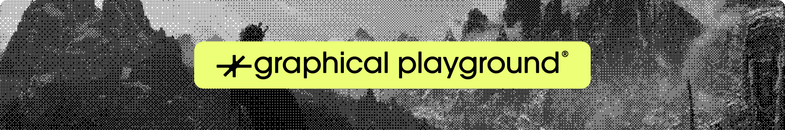
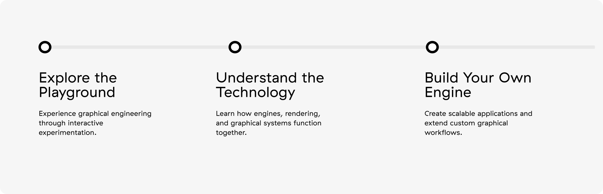
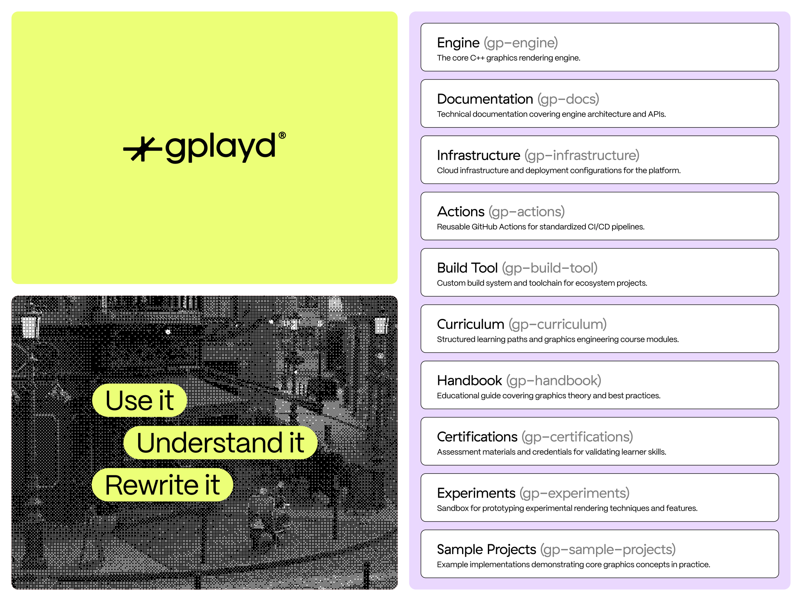
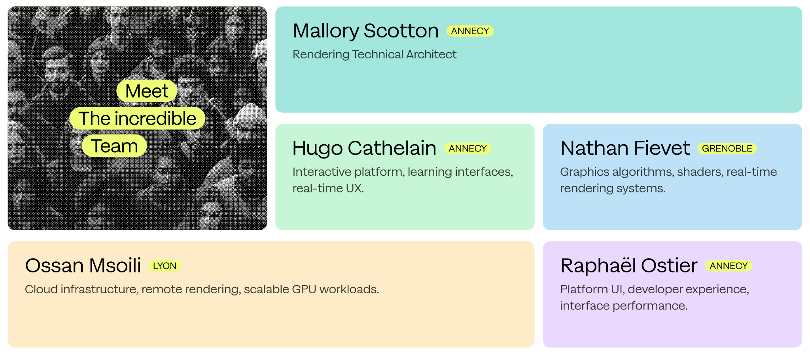

### Learning Graphics Engineering. Not Using Engines.

Graphical Playground is a hybrid ecosystem designed to democratize **Graphics Engineering**. We
bridge the gap between high-level creative tools and low-level hardware programming by providing a
frictionless, cloud-native environment for building modern rendering systems.

## The Vision: A Deconstructionist Pedagogy

Graphics engineering shouldn't be opaque. We don't just teach you to use tools; we empower you to
build them from the ground up. Our approach is inspired by the **deconstructionist pedagogy**: we
break down complex rendering systems into their fundamental components, allowing learners to
understand and reconstruct them in their own way. This method fosters deep comprehension and
creativity, enabling anyone to become a graphics engineer without needing to master every detail
of existing engines.

## The Ecosystem

The GP project is distributed across specialized repositories to ensure a production-grade
modular architecture:

## The Founders

Based in **Lyon, France (2028)**, our team combines expertise in rendering architecture,
frontend systems, and cloud infrastructure.

---

## License & Open Source

We believe in open knowledge. Most of our software is licensed under **Apache 2.0** or **MIT**,
while our educational content is protected under **Creative Commons (BY-NC-SA)** to ensure
Graphical Playground remains a fair and accessible standard for all.

---

  <b>Built for the next generation of graphics engineers.</b> 
  Open Source. Open Minds.

